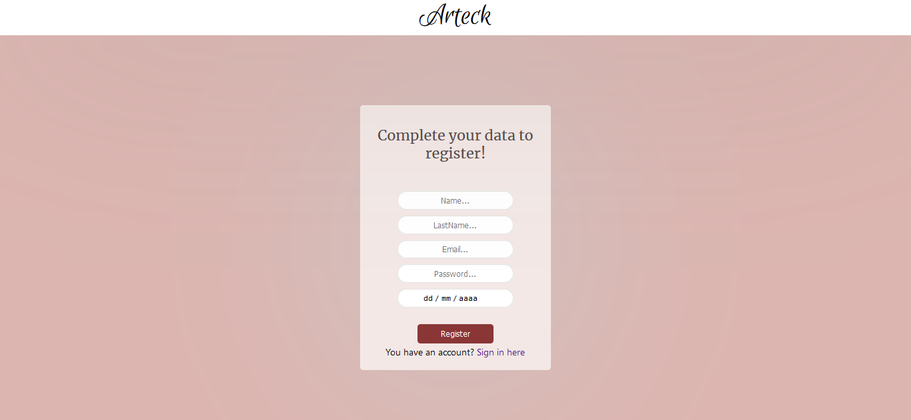
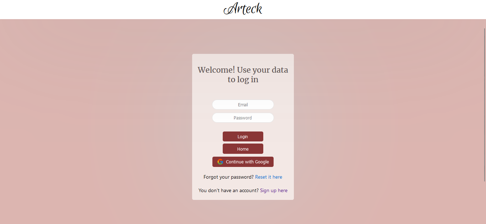
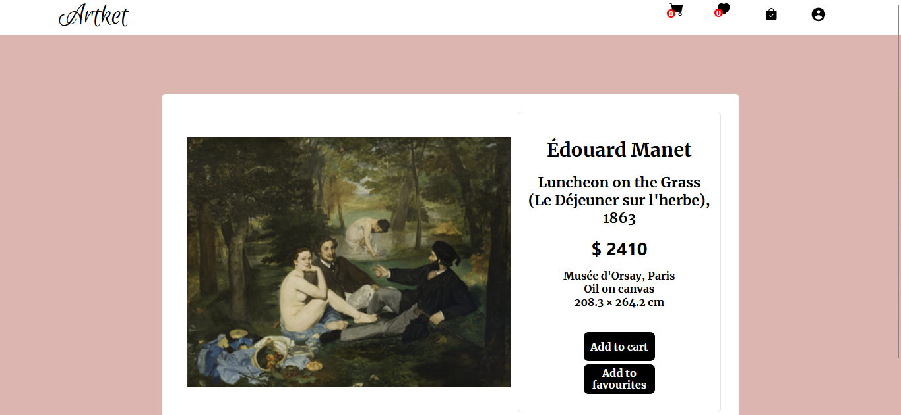
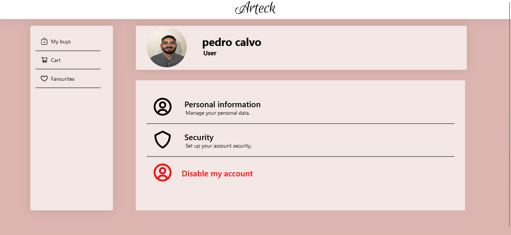
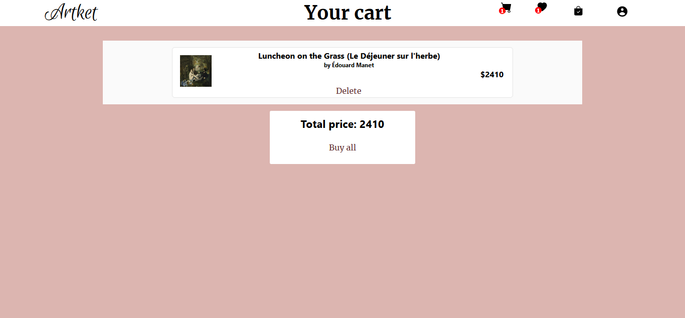
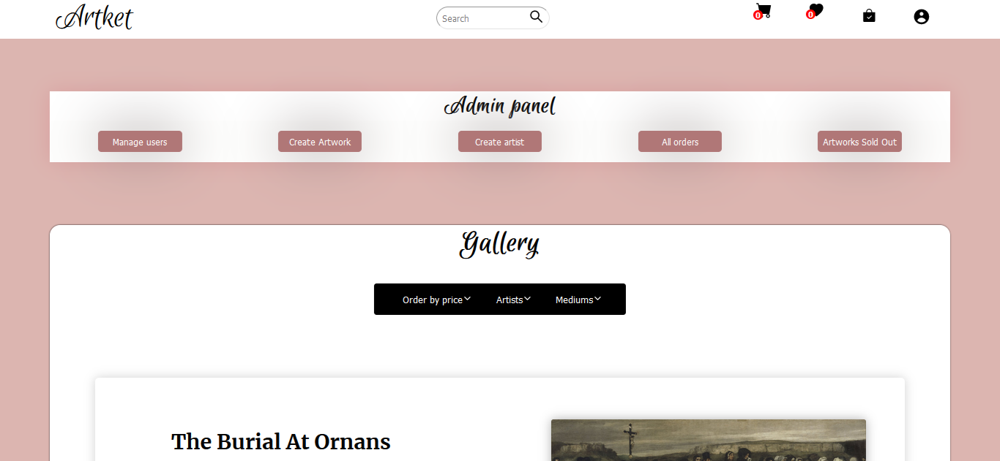
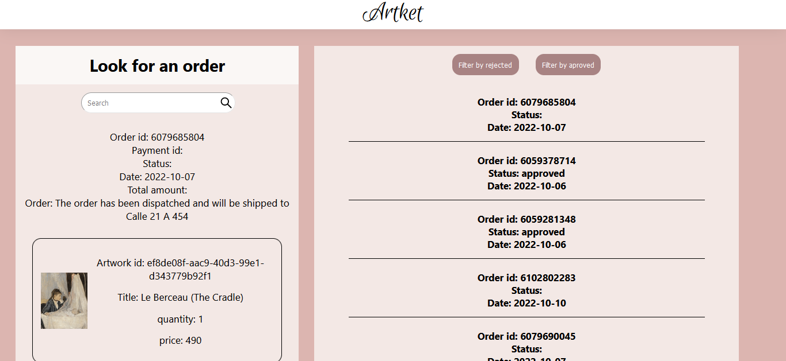

## Artket

 </img>

This is the deployment:
https://artket.vercel.app/

## Introduction

Artket is e-commerce where different artworks are presented. On this site the user can register,
add works to their shopping cart and buy them. Also has administration functionality where
admins can create works and artists or modify them too and can control the users and orders of buys.

So that you can have the repository on your computer locally you must clone it. Then in the root folder
you have two folders client and api, in both you have to run the npm install command. Then in the api folder,
you must create an .env file with this content: DB_USER = "Your DB user" DB_PASSWORD = "Your DB password" 
DB_HOST = "Your database host" DB_NAME = "The name of the database" PORT = "The port database" After running 
the npm start command, the app will open in the browser.

## BoilerPlate

The content of this folder was created with Create React App.

***Technologies:***
The content of this folder was created with Create React App.
We use the next technologies for this project: **Backend**: Node, Express, PostgreSQL, and Javascript. **Frontend**: JavaScript, React, Redux, CSS, HTML. Also we use others technologies like Auth0, sweetalert, bcrypt, JSON Web Token, Mercado Pago.

## App

The website has the next a Landing Page.
 </img>

The user can register and login.

**Register**

 </img>

**Login**

 </img>
The user can log in with her credentials or with a google account.

**Main Page**

 </img>
The user can scroll to find any artwork, filter by price, artist and medium, and also can find the work by the name.
From the main page, the user can access to the cart, favourites, orders,the profile and the detail.

**Detail**

 </img>
From here the user can aggregate the work to his cart or favourites.

**Profile**

 </img>
The user can see their information and change name, lastname, image, password.

**Cart**

 </img>

**Admin section**

Also the site have an admin panel, the admin can create artwork and artists. 
As well can manage users the admin can create new users and ban users.

 </img>

And the admin can view all orders solds in the site.

 </img>

